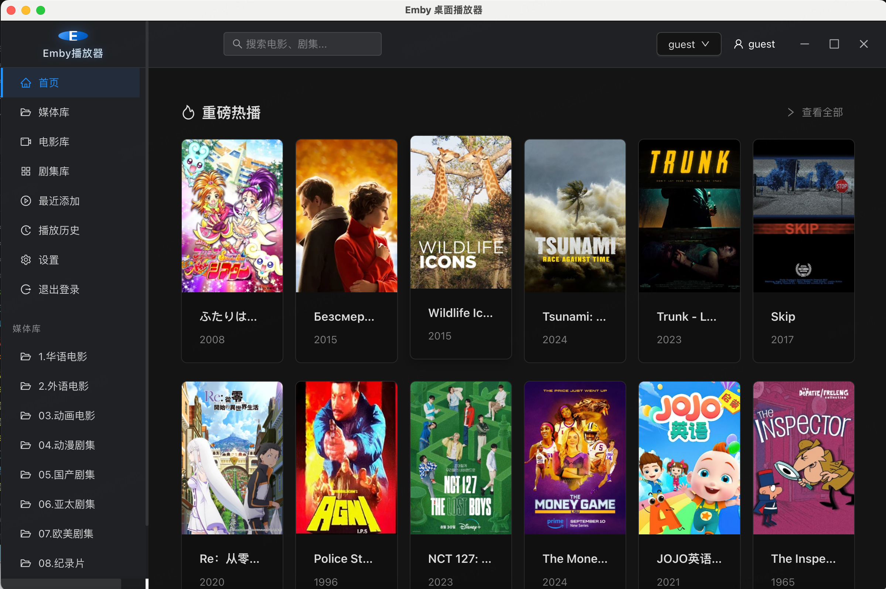
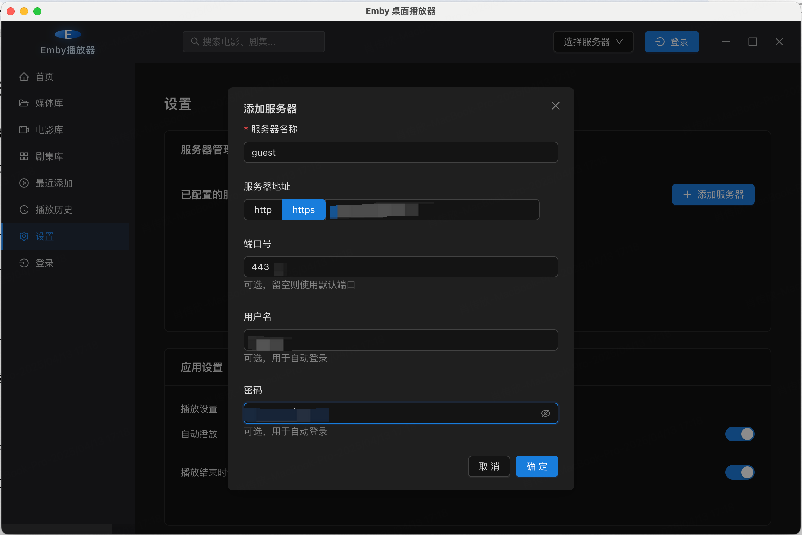

# Emby Desktop Player / Emby 桌面播放器

[English](#english) | [中文](#chinese)

<a id="english"></a>
## 📺 Emby Desktop Player

A lightweight, fast desktop client for Emby media server, built with Electron and React.

### ✨ Features

- Cross-platform support (Windows, macOS, Linux)
- Direct playback of video content from Emby servers
- HLS streaming support
- Modern and intuitive user interface
- Customizable player settings

### 🖼️ Preview





### 🚀 Installation

```bash
# Clone the repository
git clone https://github.com/CodeCrafter-bit/empy-player.git

# Navigate to project directory
cd empy-player

# Install dependencies
npm install

# Start the application in development mode
npm run electron:dev
```

### 🛠️ Building from Source

```bash
# Build the application
npm run electron:build
```

### 📦 Technology Stack

- Electron
- React
- TypeScript
- Vite
- Ant Design
- HLS.js
- VideoJS

<a id="chinese"></a>
## 📺 Emby 桌面播放器

一个轻量级、快速的 Emby 媒体服务器桌面客户端，使用 Electron 和 React 构建。

### ✨ 功能特点

- 跨平台支持（Windows、macOS、Linux）
- 直接播放来自 Emby 服务器的视频内容
- 支持 HLS 流媒体
- 现代直观的用户界面
- 可自定义的播放器设置

### 🖼️ 界面预览


### 🚀 安装方法

```bash
# 克隆仓库
git clone https://github.com/CodeCrafter-bit/empy-player.git

# 进入项目目录
cd empy-player

# 安装依赖
npm install

# 以开发模式启动应用
npm run electron:dev

#开发这模式运行，需要启动开发者工具
npm run dev
```

### 🛠️ 从源码构建

```bash
# 构建应用
npm run electron:build
```

### 📦 技术栈

- Electron
- React
- TypeScript
- Vite
- Ant Design
- HLS.js
- VideoJS

## ⚠️ 免责声明 / Disclaimer

**中文**：本项目仅供学习和研究使用，不得用于商业目的。使用本软件产生的任何法律责任由使用者自行承担。

**English**: This project is for learning and research purposes only and may not be used for commercial purposes. Any legal liability arising from the use of this software shall be borne by the user.

## 📝 License / 许可证

This project is licensed under the MIT License - see the [LICENSE](LICENSE) file for details.

本项目采用 MIT 许可证 - 查看 [LICENSE](LICENSE) 文件了解详情。 